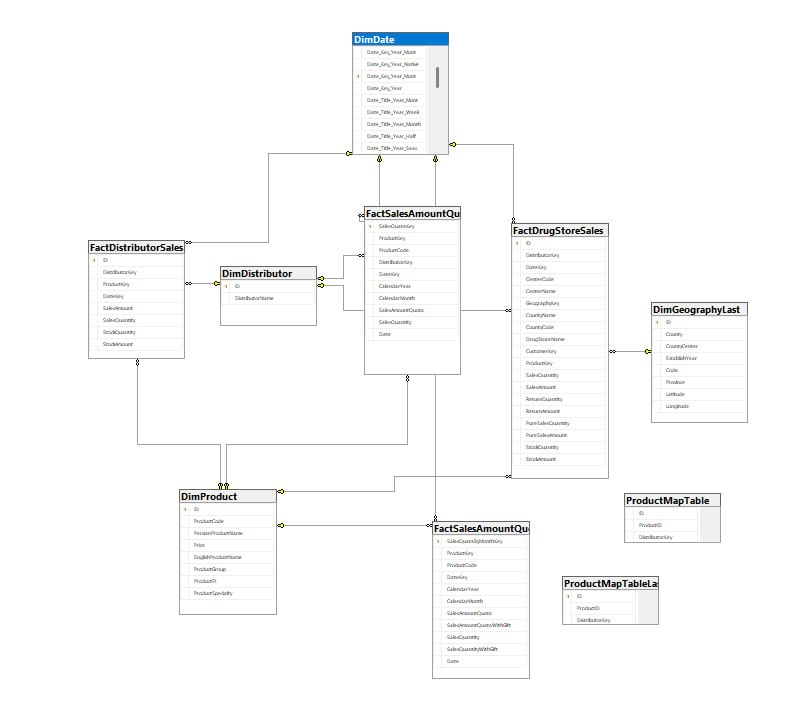

# Sales Performance Dashboard (Power BI)

This project presents an interactive Power BI dashboard designed to analyze sales performance for a pharmaceutical company.

## Data Model

The data model follows a star schema design, consisting of fact and dimension tables:

### Fact Tables

* **FactSalesAmount**: Contains sales metrics such as sales amount and quantity.
* **FactDistributorSales**: Includes distributor-level sales and stock data.
* **FactDrugStoreSales**: Stores sales, return, and stock information at the store level.

### Dimension Tables

* **DimDate**: Time-related data (year, month, etc.)
* **DimProduct**: Product details and categories
* **DimDistributor**: Distributor information
* **DimGeography**: Location-based data (country, region, etc.)

### Supporting Tables

* Product mapping tables used to connect product and distributor relationships.

## Key Features

* Analysis of sales amount, quantity, and stock levels
* Monthly sales trends and performance tracking
* Distributor and store-level performance analysis
* Sales quota vs actual performance evaluation
* Product-level insights and category breakdown

## Tools & Technologies

* Power BI (Data Modeling, DAX)
* SQL (data preparation)
* Excel (data source)

## Business Value

This dashboard helps identify sales trends, monitor performance against targets, and support data-driven decision-making in a pharmaceutical sales environment.

## Dataset

The dataset used in this project is included in the repository for demonstration purposes.

 alt="image" src="https://github.com/user-attachments/assets/cb68c7a2-e208-4d07-bfcf-7580564c1cbd" />

## Dashboard
![Dashboard]

## Data Model

## Business Insights

- Sales vary across months (seasonal trend)
- Some distributors have higher contribution
- Product performance is different across categories
